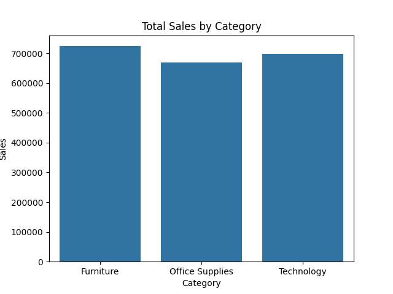
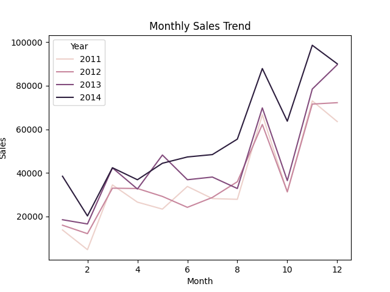
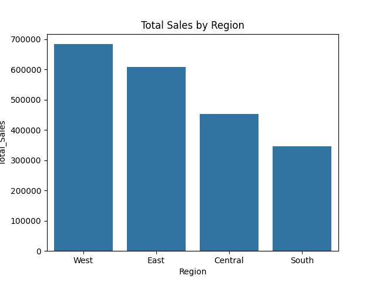

# Sales Data Analysis Project

## Overview
End-to-end exploratory data analysis (EDA) on a retail sales dataset. The project demonstrates data cleaning, transformation, visualization, and deriving business insights using Python (pandas, matplotlib, seaborn).

## Key Steps
1. **Data Loading & Inspection** — Handling missing values, data types
2. **Cleaning** — Removing duplicates, fixing inconsistencies
3. **Feature Engineering** — Creating new columns (e.g., month, year, profit margin)
4. **Exploratory Analysis** — Sales by region/product/category, time trends
5. **Visualizations** — Bar charts, line plots, heatmaps, box plots
6. **Insights & Recommendations** — Top products, seasonal patterns, underperforming regions

## Technologies Used
- Python 3
- pandas
- matplotlib
- seaborn
- Jupyter Notebook

## Dataset
- Source: [[Link to Kaggle / original source here](https://www.kaggle.com/datasets/ishanshrivastava28/superstore-sales)]
- File: Not included in repo due to size → download from [[link](https://www.kaggle.com/datasets/ishanshrivastava28/superstore-sales)]

## Key Visuals

## Business Impact
This analysis demonstrates how cleaned and visualized sales data can support decisions like:
- Inventory optimization
- Targeted promotions
- Regional strategy adjustments

## How to Run
1. Clone the repo: `git clone https://github.com/yourusername/sales-data-analysis.git`
2. Download the dataset and place it in the project folder
3. Open `sales_analysis.ipynb` in Jupyter
4. Run all cells

Feel free to ⭐ the repo if you find it useful!
